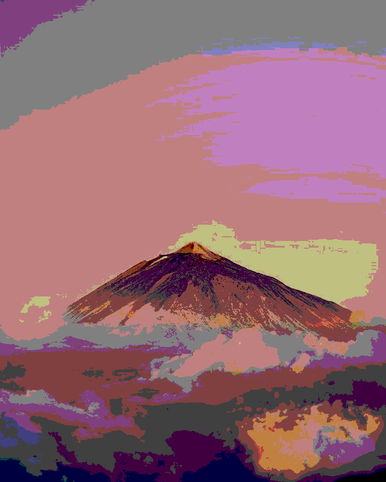

# HW1 Image Input/Output + Flip + Resolution + Scaling

## 運行方式

#### 作業系統要求: Linux

1.  首先打開terminal，並且確保當前路徑是在資料夾的根目錄，執行下面指令，makefile 會自動建立3個資料夾分別為 ``bin``、``dep`` 和 ``obj``

    ```bash
    make dir
    ```

2.  接著執行 ``make`` 進行編譯，在bin的資料夾內會出現3個執行檔，分別為 ``main_flip``、``main_quan`` 和 ``main_scaling``

3.  若要對影像做翻轉，運行

    ```bash
	./bin/main_flip ./testdata/input1.bmp ./testdata/input2.bmp
    ```

	若要對影像做quantization，運行

    ```bash
	./bin/main_quan ./testdata/input1.bmp ./testdata/input2.bmp
    ```

	若要對影像做縮放，運行

    ```bash
	./bin/main_scaling ./testdata/input1.bmp ./testdata/input2.bmp
    ```

	最後產生得結果會放在根目錄

4.  若要清除所有編譯過後所產生的資料如: ``./bin/*``、``./obj/*.o`` 和 ``./dep/*.d``，請運行

    ```bash
    make clean
    ```

## 結果

### Flip

| 原始影像 | Flip |
|:---:|:---:|
|||
|||

### Resolution

| 原始影像 | 6 bits | 4 bits | 2 bits |  
|:---:|:---:|:---:|:---:|
|||||
|||||

### Scaling

| 原始影像 | up | down |  
|:---:|:---:|:---:|
| 640 x 960 x 3 | 960 x 1440 x 3 | 424 x 640 x 3 |
| 640 x 800 x 4 | 960 x 1200 x 4 | 424 x 533 x 4 |