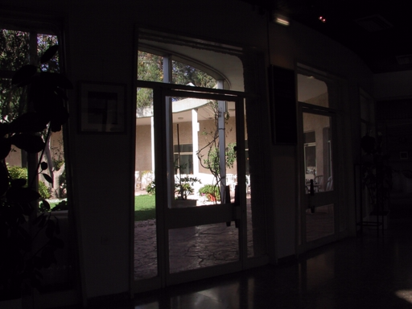
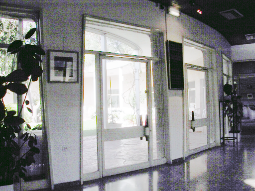
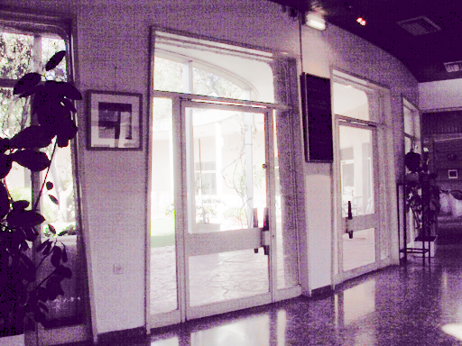
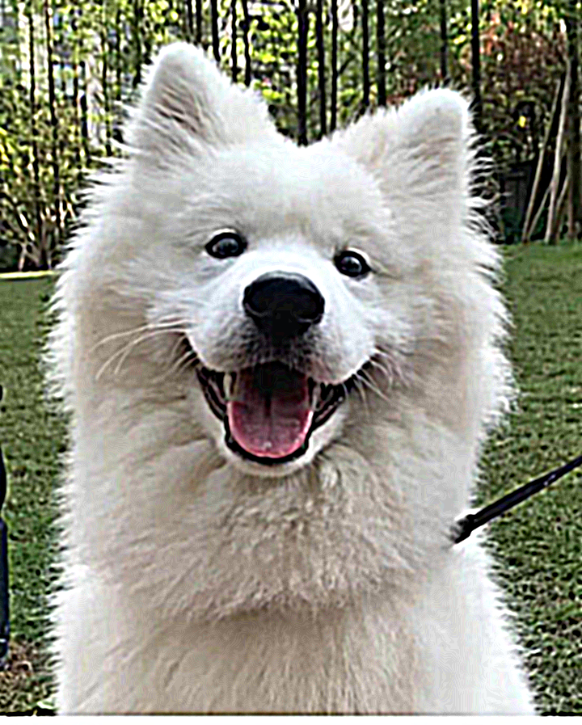
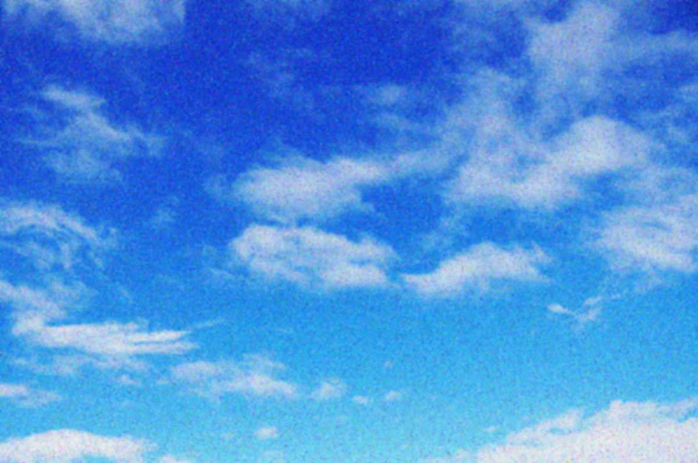

# HW2 Low-Luminosity Enhancement + Sharpness Enhancement + Denoise

### 演算法  

- Low-luminosity Enhancement : Histogram Equalization (HE)
- Sharpness Enhancement : Unsharp Masking
- Denoise : Median Filter

## 運行方式

#### 作業系統要求: Linux

1.  首先打開terminal，並且確保當前路徑是在資料夾的根目錄，執行下面指令，makefile 會自動建立3個資料夾分別為 ``bin``、``dep`` 和 ``obj``

    ```bash
    $ make dir
    ```

2.  接著執行 ``make`` 進行編譯，在bin的資料夾內會出現3個執行檔，分別為 ``main_low_luminosity``、``main_sharpness`` 和 ``main_denoise``

3.  若要提高影像亮度，運行

    ```bash
	$ ./bin/main_low_luminosity ./testdata/input1.bmp
    ```

	若要對影像做銳化，運行

    ```bash
	$ ./bin/main_sharpness ./testdata/input2.bmp
    ```

	若要對影像去噪，運行

    ```bash
	$ ./bin/main_denoise ./testdata/input3.bmp
    ```

	最後產生得結果會放在根目錄

4.  若要清除所有編譯過後所產生的資料如: ``./bin/*``、``./obj/*.o`` 和 ``./dep/*.d``，請運行

    ```bash
    $ make clean
    ```

## 結果

### Low-Luminosity

| 原始影像 | HE | 先轉換至HSL，在應用HE |  
|:---:|:---:|:---:|
||||

### Sharpness Enhancement

| 原始影像 | ratio=2 | ratio=10 |  
|:---:|:---:|:---:|
||||

### Denoise

| 原始影像 | kernel 5x5 | kernel 9x9 |  
|:---:|:---:|:---:|
||||