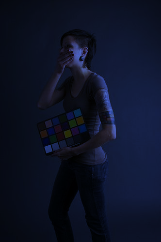
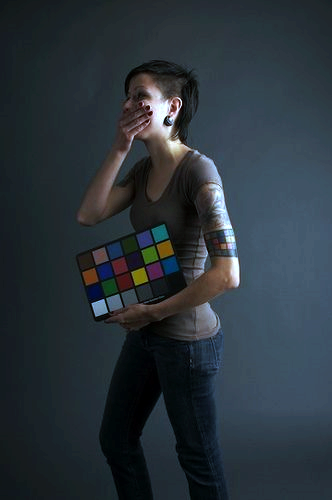

# HW3 Chromatic Adaptation + Image Enhancement

**演算法**

- Chromatic Adaptation : A Novel Automatic White Balance Method For
Digital Still Cameras
- Image Enhancement : Rescaling Intensity

## 運行方式

**作業系統要求: Linux**

1.  首先打開terminal，並且確保當前路徑是在資料夾的根目錄，執行下面指令，makefile 會自動建立3個資料夾分別為 ``bin``、``dep`` 和 ``obj``

    ```bash
    $ make dir
    ```

2.  接著執行 ``make`` 進行編譯，在bin的資料夾內會出現3個執行檔，分別為 ``main_image_enhancement`` 和 ``main_color_constancy``

3.  若要對影像做白平衡，執行

    ```bash
	$ ./bin/main_color_constancy ./testdata/input*
    ```

	若要對影像做enhancement，輸入影像為白平衡後的結果，執行

    ```bash
	$ ./bin/main_image_enhancement ./*_1.bmp
    ```

	最後產生得結果會放在根目錄

4.  若要清除所有編譯過後所產生的資料如: ``./bin/*``、``./obj/*.o`` 和 ``./dep/*.d``，請運行

    ```bash
    $ make clean
    ```

## 結果

| 原始影像 | Chromatic Adaptation | Image Enhancement |  
|:---:|:---:|:---:|
||||
||||
||||
||||

## Citations

> @INPROCEEDINGS{1465458,author={Ching-Chih Weng and Chen, H. and Chiou-Shann Fuh},booktitle={2005 IEEE International Symposium on Circuits and Systems (ISCAS)}, title={A novel automatic white balance method for digital still cameras}, year={2005},volume={},number={},pages={3801-3804 Vol. 4},doi={10.1109/ISCAS.2005.1465458}}
